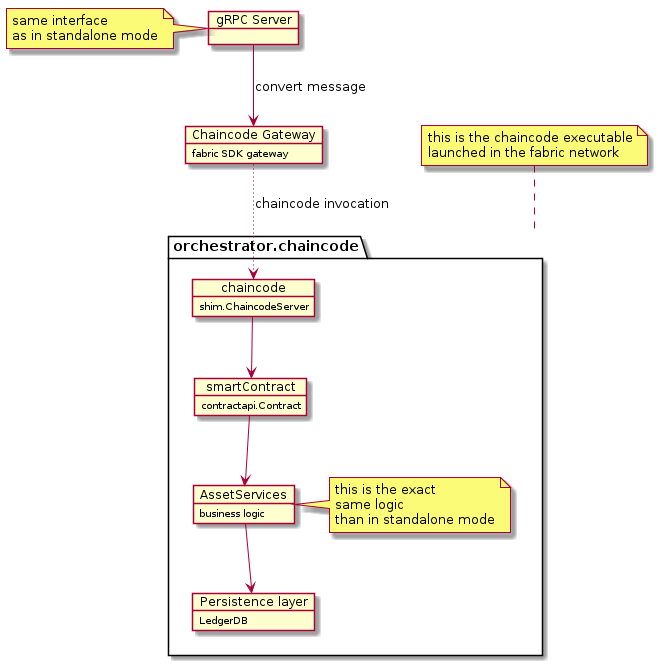
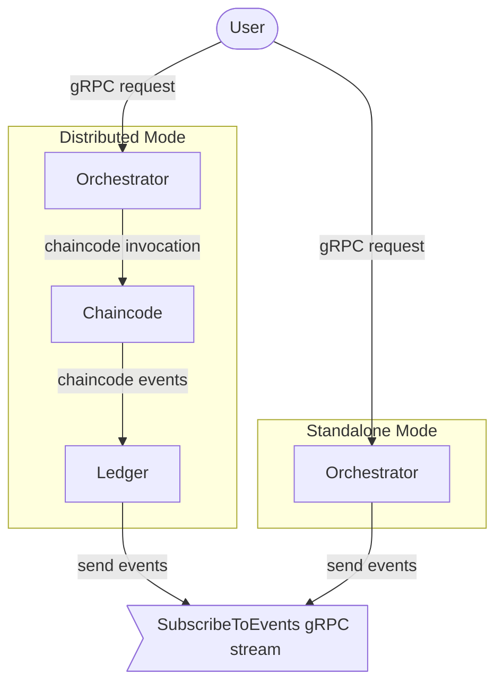
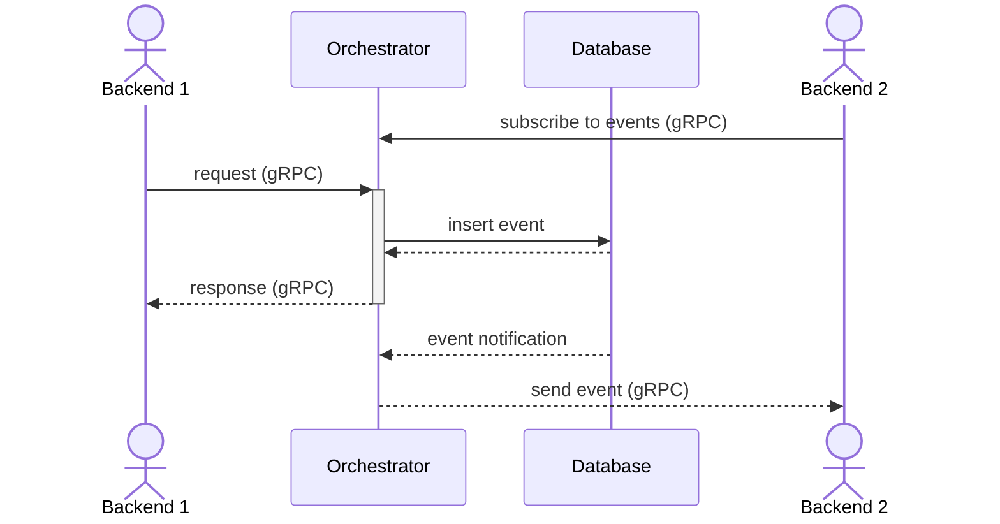
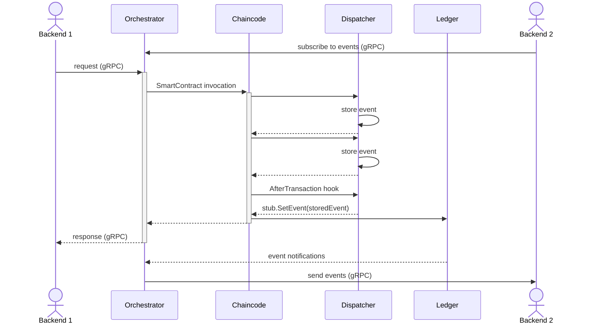

# General architecture

The orchestrator is the core piece handling Substra assets such as Organizations, ComputePlans, TrainTuples, etc.

This repository contains two binaries: `orchestrator` and `chaincode`.

When running in standalone mode, the only dependency is a PostgreSQL instance for persistence.
Here is a basic overview of the standalone execution mode:

The chaincode comes into action when running in a hyperledger-fabric context,
where it is deployed as a regular fabric chaincode.
In that situation, the orchestrator lean on the chaincode and act as a facade,
its sole purpose is to convert gRPC calls into chaincode invocation.

By doing so, we always expose the same interface (gRPC) to external callers.
That means the standalone or distributed deployments can be swapped without any impact on callers.

However, please note that there is no data migration.
Since persistence layers are different from a mode to another,
switching modes will result in a full reset.

## Orchestrator

`orchestrator` is a gRPC server which can run in two modes:
- standalone: no ledger is needed, the orchestrator talks directly to a database
- distributed: the orchestrator is only a facade forwarding all calls to the fabric chaincode

## Chaincode

`chaincode` is the [hyperledger fabric chaincode](https://hyperledger-fabric.readthedocs.io/en/release-2.2/chaincode4ade.html#writing-your-first-chaincode) implementation and conforms to fabric API.

## Common lib

Since both the standalone orchestrator and the distributed orchestrator have to manipulate the assets,
it makes sense that they rely on the same common lib; which you can find in the `lib` directory.

It provides abstractions to manipulate the assets and implement your own persistence layer (`persistence.DBAL`).

All the assets are defined by their protobuf in `lib/asset`.
You'll also find in this directory the validation implementation for each asset.

The business logic to handle those assets is defined in `lib/service`,
where each asset is managed by a dedicated service.

Here is an overview of the orchestration part, which is completely independent of the execution mode (standalone or distributed):

To avoid tight coupling, the `Provider` implements a dependency injection pattern
so that an asset service can call other services.

There are two implementations of the DBAL interface:
Postgresql in standalone mode and LedgerDB when running in distributed mode.

## Event dispatch

Consumers may need to react to events.
To that end, the orchestrator will emit events in `SubscribeToEvents` gRPC stream.

When running in distributed mode, there will be a conversion between ledger events from the chaincode
and events emitted by the orchestrator.

Following the pattern of the gRPC API, events will have the same structure regardless of the execution mode.
Consumers should not have to adapt to the distributed ledger and should only interact with the orchestrator 
`SubscribeToEvents` gRPC stream.

### Standalone execution

Events are inserted in the `events` table during the transaction,
and dispatched in the active `SubscribeToEvents` gRPC streams once the transaction has been successfully processed.

### Distributed execution

In distributed mode, events are stored during the transaction processing and _emitted_ once
in the [AfterTransaction hook](https://github.com/hyperledger/fabric-contract-api-go/blob/master/tutorials/using-advanced-features.md#transaction-hooks).
This address a limitation of fabric: [only one event can be set per transaction](https://github.com/hyperledger/fabric-chaincode-go/blob/f8ef75b1771978c17ed56e52b5bfc22d4bdae5e3/shim/interfaces.go#L344-L350).

The workflow is represented below:

## Concurrent request processing

When running in distributed mode, the distributed ledger enforces consistency by validating both read & write of the storage made by a request.
That means that one can't end up with inconsistent query.
If two concurrent proposals update the same resource, the first to go through will define a new state.
That makes the second proposal invalid since the state has changed.
In this case, the fabric peer will issue a new proposal based on the right state.

The same level of consistency is provided in standalone mode by leveraging [postgresql's isolation level](https://www.postgresql.org/docs/current/transaction-iso.html#XACT-SERIALIZABLE).
By enforcing serializable transaction, we make sure we don't rely on inconsistent data.

## Authentication

**Note**: MSP ID stands for [Membership Service Provider](https://hyperledger-fabric.readthedocs.io/en/release-2.3/msp.html), which is inherited from the chaincode.
In this section uses the two terms `MSPID` and `Organization` are used interchangeably.

Access control is done at the transport level: if `ORCHESTRATOR_MTLS_ENABLED` is enabled, the client is required to provide a valid certificate.

Assets are owned by different organizations, so we need to identify the caller:
this is done through the `mspid` request header.

This header can be freely set by the caller, so we should assume that this is insecure.

To address an adversarial user in the network, we can enable `ORCHESTRATOR_VERIFY_CLIENT_MSP_ID`.
This will add several checks to the header

**Certificate's organization check**: the given mspid header will be checked against the client certificate's organizations.
If the header is not included in the certificate organizations, the access will be denied.

**CA organization check**: the orchestrator will make sure that the client certificate has been signed by a CA valid for the given organization.
Enabling mutual TLS is not enough because we would still be vulnerable to the case where an adversarial organization creates a certificate for another org (`mspid`).
Since any certificate signed by a trusted CA is considered valid, a client certificate for *org2* signed by CA cert *org1* would be valid.
To address this issue, we maintain a list of valid CA per organization and make sure that the client certificate has been signed by a CA allowed for the given `mspid`.

**Note**: CA check is not a silver bullet, there are some pitfalls to avoid:
- if the same CA certificate is used by two different organization, it would still be possible to impersonate one from the other;
- if you trust a public CA (like let's encrypt), anyone can request a certificate, leaving you open to impersonation as well;
