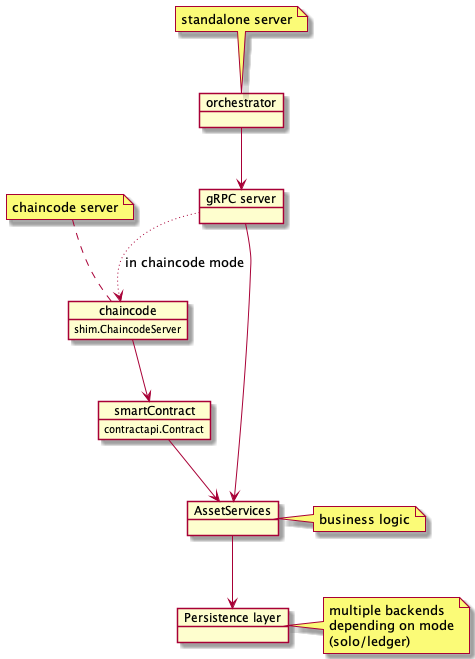
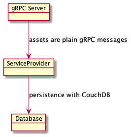
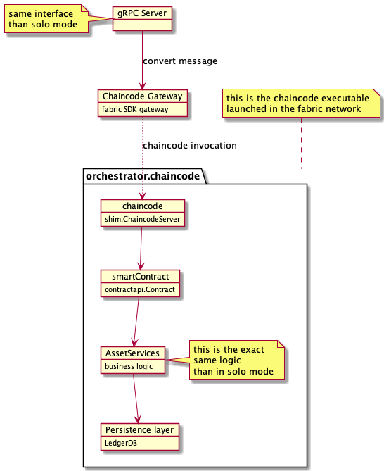
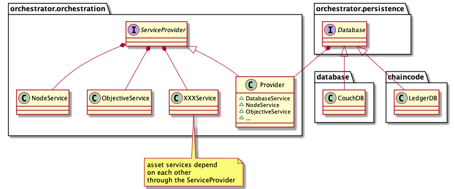

# General architecture

The orchestrator is the core piece handling Substra assets such as Nodes, ComputePlans, TrainTuples, etc.

This repository contains two binaries: `orchestrator` and `chaincode`.

When running in independent (or solo) mode, the only dependency is a couchdb instance for persistence.
Here is a basic overview of the solo mode execution mode:

The chaincode comes into action when running in a hyperledger-fabric context,
where it is deployed as a regular fabric chaincode.
In that situation, the orchestrator lean on the chaincode and act as a facade,
its sole purpose is to convert gRPC calls into chaincode invocation.

By doing so, we always expose the same interface (gRPC) to external callers.
That means the solo or chaincode deployments can be swapped without any impact on callers.

However please note that there is no data migration.
Since persistence layers are different from a mode to another,
switching modes will result in a full reset.

## Orchestrator

`orchestrator` is a gRPC server which can run in two modes:
- standalone: no ledger is needed, the orchestrator talks directly to a database
- chaincode: the orchestrator is only a facade forwarding all calls to the fabric chaincode

## Chaincode

`chaincode` is the [hyperledger fabric chaincode](https://hyperledger-fabric.readthedocs.io/en/release-2.2/chaincode4ade.html#writing-your-first-chaincode) implementation and conforms to fabric API.

## Common lib

Since both the standalone orchestrator and the chaincode have to manipulate the assets,
it makes sense that they rely on the same common lib; which you can find in the `lib` directory.

It provides abstractions to manipulate the assets and implement your own persistence layer (`persistence.Database`).

All the assets are defined by their protobuf in `lib/assets`.
You'll also find in this directory the validation implementation for each asset.

The business logic to handle those assets is defined in `lib/orchestration`,
where each asset is managed by a dedicated service.

Here is an overview of the orchestration part, which is completely independent of the execution mode (solo or ledger):

To avoid tight coupling, the `Provider` implements a dependency injection pattern
so that an asset service can call other services.

There are two implementations of the Database interface:
CouchDB in solo mode and LedgerDB when running as chaincode.
