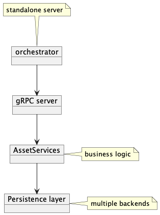
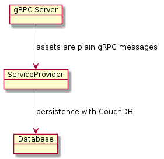
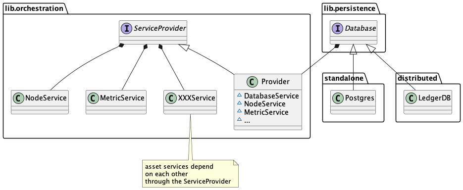
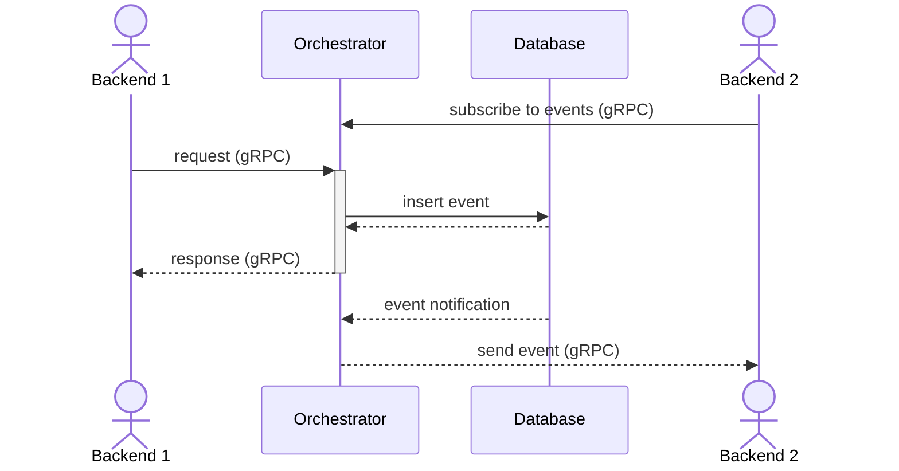

# General architecture

The orchestrator is the core piece handling Substra assets such as Organizations, ComputePlans, TrainTuples, etc.

This repository contain binaries for the `orchestrator`.

When running in standalone mode, the only dependency is a PostgreSQL instance for persistence.
Here is a basic overview of the standalone execution mode:

## Orchestrator

`orchestrator` is a gRPC server which talks directly to a database

## Common lib

The common lib provides abstractions to manipulate the assets and implement your own persistence layer (`persistence.DBAL`).

All the assets are defined by their protobuf in `lib/asset`.
You'll also find in this directory the validation implementation for each asset.

The business logic to handle those assets is defined in `lib/service`,
where each asset is managed by a dedicated service.

Here is an overview of the orchestration part:

To avoid tight coupling, the `Provider` implements a dependency injection pattern
so that an asset service can call other services.

There are two implementations of the DBAL interface:
Postgresql in standalone mode.

## Event dispatch

Consumers may need to react to events.
To that end, the orchestrator will emit events in `SubscribeToEvents` gRPC stream.

Following the pattern of the gRPC API, events will have the same structure regardless of the execution mode.
Consumers should only interact with the orchestrator `SubscribeToEvents` gRPC stream.

### Standalone execution

Events are inserted in the `events` table during the transaction,
and dispatched in the active `SubscribeToEvents` gRPC streams once the transaction has been successfully processed.

