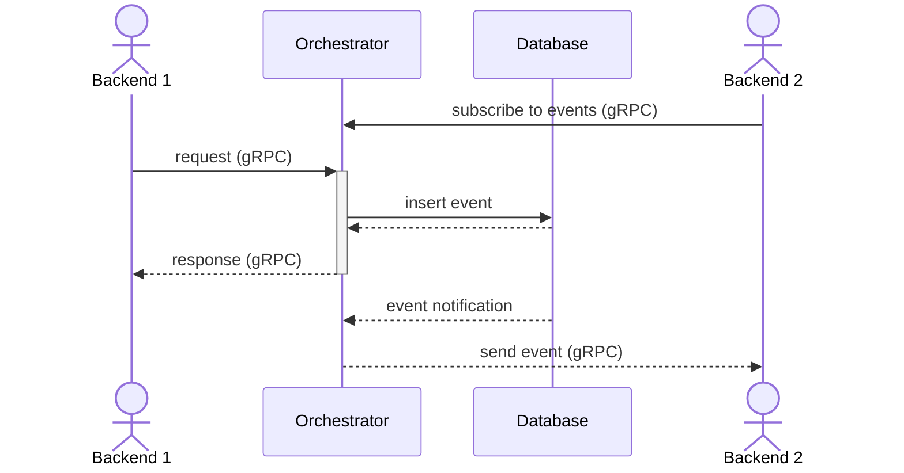

# General architecture

The orchestrator is the core piece handling Substra assets such as Organizations, ComputePlans, TrainTuples, etc.

This repository contains binaries for the `orchestrator`.

When running in standalone mode, the only dependency is a PostgreSQL instance for persistence.
Here is a basic overview of the standalone execution mode:

## Orchestrator

`orchestrator` is a gRPC server which talks directly to a database

## Common lib

The common lib provides abstractions to manipulate the assets and implement your own persistence layer (`persistence.DBAL`).

All the assets are defined by their protobuf in `lib/asset`.
You'll also find in this directory the validation implementation for each asset.

The business logic to handle those assets is defined in `lib/service`,
where each asset is managed by a dedicated service.

Here is an overview of the orchestration part:

To avoid tight coupling, the `Provider` implements a dependency injection pattern
so that an asset service can call other services.

The DBAL implements an interface to PostgreSQL.

## Event dispatch

Consumers may need to react to events.
To that end, the orchestrator will emit events in `SubscribeToEvents` gRPC stream.

Following the pattern of the gRPC API, events will have the same structure regardless of the execution mode.
Consumers should only interact with the orchestrator `SubscribeToEvents` gRPC stream.

### Standalone execution

Events are inserted in the `events` table during the transaction,
and dispatched in the active `SubscribeToEvents` gRPC streams once the transaction has been successfully processed.

## Concurrent request processing

The consistency is provided  by leveraging [postgresql's isolation level](https://www.postgresql.org/docs/current/transaction-iso.html#XACT-SERIALIZABLE).

By enforcing serializable transaction, we make sure we don't rely on inconsistent data.

## Authentication

**Note**: MSP ID stands for **Membership Service Provider** (legacy name from distributed mode).
In this section uses the two terms `MSPID` and `Organization` are used interchangeably.

Access control is done at the transport level: if `ORCHESTRATOR_MTLS_ENABLED` is enabled, the client is required to provide a valid certificate.

Assets are owned by different organizations, so we need to identify the caller:
this is done through the `mspid` request header.

This header can be freely set by the caller, so we should assume that this is insecure.

To address an adversarial user in the network, we can enable `ORCHESTRATOR_VERIFY_CLIENT_MSP_ID`.
This will add several checks to the header

**Certificate's organization check**: the given mspid header will be checked against the client certificate's organizations.
If the header is not included in the certificate organizations, the access will be denied.

**CA organization check**: the orchestrator will make sure that the client certificate has been signed by a CA valid for the given organization.
Enabling mutual TLS is not enough because we would still be vulnerable to the case where an adversarial organization creates a certificate for another org (`mspid`).
Since any certificate signed by a trusted CA is considered valid, a client certificate for *org2* signed by CA cert *org1* would be valid.
To address this issue, we maintain a list of valid CA per organization and make sure that the client certificate has been signed by a CA allowed for the given `mspid`.

**Note**: CA check is not a silver bullet, there are some pitfalls to avoid:
- if the same CA certificate is used by two different organization, it would still be possible to impersonate one from the other;
- if you trust a public CA (like let's encrypt), anyone can request a certificate, leaving you open to impersonation as well;