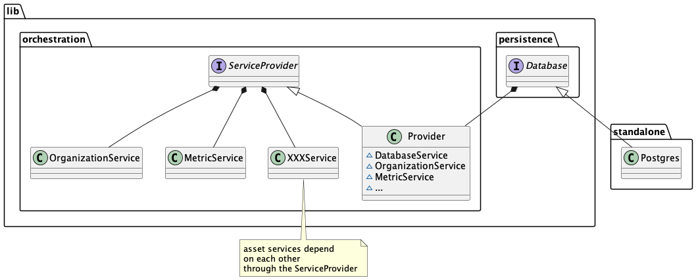

# General architecture

The orchestrator is the core piece handling Substra assets such as Nodes, ComputePlans, TrainTuples, etc.

This repository contains two binaries: `orchestrator` and `chaincode`.

When running in standalone mode, the only dependency is a PostgreSQL instance for persistence.
Here is a basic overview of the standalone execution mode:

The chaincode comes into action when running in a hyperledger-fabric context,
where it is deployed as a regular fabric chaincode.
In that situation, the orchestrator lean on the chaincode and act as a facade,
its sole purpose is to convert gRPC calls into chaincode invocation.

By doing so, we always expose the same interface (gRPC) to external callers.
That means the standalone or distributed deployments can be swapped without any impact on callers.

However please note that there is no data migration.
Since persistence layers are different from a mode to another,
switching modes will result in a full reset.

## Orchestrator

`orchestrator` is a gRPC server which can run in two modes:
- standalone: no ledger is needed, the orchestrator talks directly to a database
- distributed: the orchestrator is only a facade forwarding all calls to the fabric chaincode

## Chaincode

`chaincode` is the [hyperledger fabric chaincode](https://hyperledger-fabric.readthedocs.io/en/release-2.2/chaincode4ade.html#writing-your-first-chaincode) implementation and conforms to fabric API.

## Common lib

Since both the standalone orchestrator and the distributed orchestrator have to manipulate the assets,
it makes sense that they rely on the same common lib; which you can find in the `lib` directory.

It provides abstractions to manipulate the assets and implement your own persistence layer (`persistence.DBAL`).

All the assets are defined by their protobuf in `lib/asset`.
You'll also find in this directory the validation implementation for each asset.

The business logic to handle those assets is defined in `lib/service`,
where each asset is managed by a dedicated service.

Here is an overview of the orchestration part, which is completely independent of the execution mode (standalone or distributed):

To avoid tight coupling, the `Provider` implements a dependency injection pattern
so that an asset service can call other services.

There are two implementations of the DBAL interface:
Postgresql in standalone mode and LedgerDB when running in distributed mode.

## Event dispatch

Consumers may need to react to events.
To that end, the orchestrator will emit events on an AMQP broker (rabbitmq).

When running in distributed mode, there will be a conversion between ledger events from the chaincode
and events emitted by the orchestrator.

Following the pattern of the gRPC API, events will be have the same structure regardless of the execution mode.
Consumers should not have to adapt to the distributed ledger and should only interact with the broker.

### Standalone execution

Events are pushed in a queue during the transaction, and dispatched once the transaction has been successfully processed.

### Distributed execution

In distributed mode, events are stored during the transaction processing and _emitted_ once
in the [AfterTransaction hook](https://github.com/hyperledger/fabric-contract-api-go/blob/master/tutorials/using-advanced-features.md#transaction-hooks).
This address a limitation of fabric: [only one event can be set per transaction](https://github.com/hyperledger/fabric-chaincode-go/blob/f8ef75b1771978c17ed56e52b5bfc22d4bdae5e3/shim/interfaces.go#L344-L350).

The workflow is represented below:

### Rabbitmq routing

In order to both support multiple channels and provide isolation between them,
we leverage rabbitmq routing capabilities to keep things as simple as possible for producer and consumers.

That means there is only one entry point (the *orchestration*  exchange) on which the orchestrator publishes
and one queue per consumer.

Consumers only have access to their own queue, which may receives events from multiple channels (according to the configuration).

## Concurrent request processing

When running in distributed mode, the distributed ledger enforces consistency by validating both read & write of the storage made by a request.
That means that one can't end up with inconsistent query.
If two concurrent proposals update the same resource, the first to go through will define a new state.
That makes the second proposal invalid since the state has changed.
In this case, the fabric peer will issue a new proposal based on the right state.

This mechanism does not existing in standalone mode, yet the orchestrator may receive concurrent requests.
To offer the same level of consistency, one solution is to artificially contrain requests to be processed one after another.
This is what is implemented by the concurrency limiter in standalone mode.
gRPC handlers will only process the request once issued an execution token
and a global scheduler makes sure that there is no more than one processing handlers at a time.
