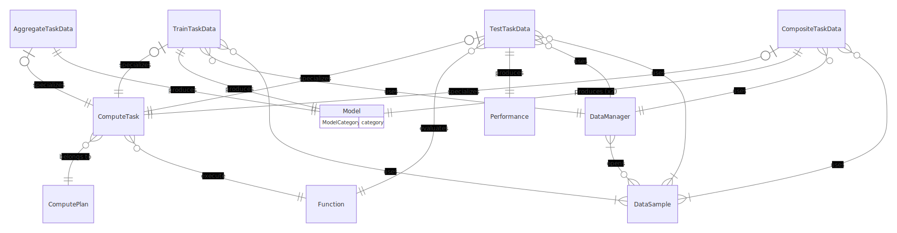

# Assets

Here we describe the assets and how they are manipulated by the orchestrator.

Asset list:

- [Function](./function.md)
- [ComputeTask](./computetask.md)
- [DataManager](./datamanager.md)
- [DataSamples](./datasamples.md)
- [Model](./model.md)

Here is an overview of how assets relate to each other:

## Assets lifecycle

The assets all serve a single goal: produce models and measure their performances.

It all starts with data registration: a **[DataManager](./datamanager.md)** is created, defining how to open specific samples (opener).

Then, **[DataSamples](./datasamples.md)** are attached to the **DataManager**.
These samples can be either used during both training and testing or restricted to be only used for testing.

Functions are then created and embed: the actual python function, a Dockerfile to build it and a description file.
**[Functions](./function.md)** can produce models (train), or evaluate performances of such models (eval).

Once all those basic assets are defined, a **ComputePlan** can be registered.
A ComputePlan is a way to group tasks [ComputeTasks](./computetask.md) related to a common project.
Tasks are related to one another in a directed acyclic graph: output models are consumed by tasks of higher rank.

The final step is to define the graph of **ComputeTasks**.
Tasks are the core asset of the orchestrator, they represent the execution of an Function to produce Artifacts.
They glue together the **Functions**, **DataManager** and **DataSamples**.

When a task is processed, it outputs one or more **Model** or **Performance**.
The produced **[Model](./model.md)** will inherit its permissions from different parents: task definition, data processed, etc.
See more details in [related section of the doc](../permissions.md).
