# Compute Task

A compute task is a generic structure representing a step in a [compute plan](./computeplan.md).
There are 5 different kind of tasks:

- Train
- Test
- Aggregate
- Composite
- Predict

While the `ComputeTask` structure holds common fields, type-specific fields are held by dedicated substructures.

Train, Aggregate, Composite and Predict tasks can produce one or more [models](./model.md) as output.
Those models will have different [permissions](./permissions.md), which will be determined on task creation.

## Compute task outputs

Upon successful execution, compute task should generate *outputs* which correspond to the outputs defined in their [Algo](./algo.md).
Each compute task output has a separate set of [Permissions](../permissions.md).
The permissions must be set for each output at task creation,
with the exception of outputs of kind "performance" which are always public and for which setting specific permissions is not allowed.

## Compatibility

Tasks receive explicit inputs, they can be either:

- a direct reference to an existing asset
- or a reference to another task's output

On task creation, inputs should match the expectations of the algorithm used:

- mandatory inputs should be defined
- asset kind should match

Permissions are checked on each asset to ensure that processing and access is allowed.

A task cannot have more than one datamanager as an input
and all its datasamples should be associated with this datamanager.

## Rank

A task is executed as part of a [compute plan](./computeplan.md).
Inside the graph of tasks, each task has a rank depending on its depth in the graph.

General rules are:

- A task with no parents has a rank of `0`
- A task with parents has a rank of `max(parentRanks) + 1`

Since parents are set during task definition, the rank is an immutable property.

## Status

A task can have several status (see *States* below for available transitions):

- WAITING: new task waiting for its parents to be DONE. In this state the task cannot be processed yet.
- TODO: all dependencies are built (all parents DONE) so the task can be picked up by a worker and processed.
- DOING: the task is being processed by a worker.
- DONE: task has been successfully completed.
- FAILED: task execution has failed.
- CANCELED: task execution has been canceled before completion.

## State

A compute task will go through different state during a compute plan execution.
This is an overview of a task's lifecycle:

A task can be created in TODO or WAITING state depending on its parents.

During the ComputePlan execution, as tasks are DONE, their statuses will be reflected to their children.
If all the parents of a child task are DONE, this task enters TODO state.

When a parent task fails, children statuses are not changed.

A task may produce one or more [models](./model.md), they can only be registered when the task is in DOING.
This is to ensure that when a task starts (switch to DOING), all its inputs are available.

### Status change

A status change is a reaction to an action.
Task actions should match the following restrictions:

| action ↓ / sender → | Owner | Worker | Other |
|---------------------|-------|--------|-------|
| DOING               | n     | y      | n     |
| CANCELED            | y     | n      | n     |
| FAILED              | n     | y      | n     |
| DONE                | n     | y      | n     |

Basically:

- only the owner can cancel a task
- only the worker can act on a task processing (DOING/DONE/FAILED)

## Worker

A task is processed on a specific worker.

Most of the time, the worker can be inferred from task inputs: it should be where the data is, ie. the datamanager's owner.
In those cases, the `NewComputeTask.Worker` field is optional and an error will be returned if the specified worker does not match the data owner.

For tasks without data input (such as model aggregation tasks), the worker **MUST** explicitly be set on task creation.
