# Compute Task

A compute task is a generic structure representing a compute task in a compute plan.
There are 4 different kind of tasks:
- Train
- Test
- Aggregate
- Composite

While the `ComputeTask` structure holds common fields, type-specific fields are held by dedicated substructures.

## Compatibility

Since a compute task will receive models from their parents,
there are some restrictions on which parents are allowed for each task.

Here is the expected cardinality for each task category:

**Note**:
- the asterisk denotes an exclusive link, ie a *Train* task can only have **one** parent at most
- parenthesis denotes optional dependencies
- no parents is a valid input

| children ↓ / parent → | Train | Test | Aggregate | Composite |
|-----------------------|-------|------|-----------|-----------|
| Train                 | n     | 0    | n         | 0         |
| Test                  | 1*    | 0    | 0         | 1*        |
| Aggregate             | n     | 0    | n         | n         |
| Composite             | 0     | 0    | (1)       | 1         |

## State

A compute task will go through different state during a compute plan execution.
This is an overview of a task's lifecycle:

A task can be created in almost any state (except DOING/DONE) depending on its parents.

During the ComputePlan execution, as tasks are done or failed, their statuses will be reflected to their children.
This is done in a recursive way: a failed or canceled task propagate a "CANCELED" status to all its children.

In case of success (task DONE), this is a bit more convoluted since we need to iterate over the children
and all their parents to update them to TODO if all the parents are DONE.

A task may produces one or more [models](./model.md), they can only be registered when the task in in DOING.
This is to ensure that when a task starts (switch to DOING), all its inputs are available.

### Status change

A status change is a reaction to an action.
Task actions should match the following restrictions:

| action ↓ / sender → | Owner | Worker | Other |
|---------------------|-------|--------|-------|
| DOING               | n     | y      | n     |
| DONE                | n     | y      | n     |
| CANCELED            | y     | n      | n     |
| FAILED              | n     | y      | n     |

Basically:
- only the owner can cancel a task
- only the worker can act on a task processing (DOING/DONE/FAILED)
