# DataManager
A DataManager contains metadata related to DataSamples. Mainly informations related to the Opener that is to be used to load the data and the permissions required to process the DataSamples.
## Register

## Update

### Permissions check
This describe the permission check performed by the orchestrator before updating a DataManager as currently implemented.

