# DataManager
A DataManager contains metadata related to DataSamples. Mainly information related to the Opener that is to be used to load the data and the permissions required to process the DataSamples.

## Register

### Activity diagram

