# DataManager
A DataManager contains metadata related to DataSamples. Mainly informations related to the Opener that is to be used to load the data and the permissions required to process the DataSamples.
## Register

### Activity diagram

## Update

### Activity diagram

## Permission table
| Action   | Requester |  Owner  | Can requester process datamanager | Can owner process objective | outcome |
| ---      | ---       | ---     | ---                               | ---                         | ---     |
| Register | `org-1`   | N/A     | N/A                               | `True`                      | allowed |
| Register | `org-1`   | N/A     | N/A                               | `False`                     | denied  |
| Update   | `org-1`   | `org-1` | `True`                            | `True`                      | allowed |
| Update   | `org-1`   | `org-1` | `True`                            | `False`                     | denied  |
| Update   | `org-1`   | `org-2` | `True`                            | `True`                      | allowed |
| Update   | `org-1`   | `org-2` | `True`                            | `False`                     | denied  |
| Update   | `org-1`   | `org-2` | `False`                           | `True`                      | denied  |
