# DataSample

A DataSample contains the metadata of sample of data. Mainly the datamanagers to which it is attached and whether the sample is for testing purposes only.

## Register

### Activity diagram

## Update

### Activity diagram

## Permission table
| Action   | Requester |  Owner  | DataManager Owner | outcome |
| ---      | ---       | ---     | ---               | ---     |
| Register | `org-1`   | N/A     | `org-1`           | allowed |
| Register | `org-1`   | N/A     | `org-2`           | denied  |
| Update   | `org-1`   | `org-1` | `org-1`           | allowed |
| Update   | `org-1`   | `org-2` | `org-2`           | denied  |
| Update   | `org-1`   | `org-1` | `org-2`           | denied  |
| Update   | `org-1`   | `org-2` | `org-1`           | denied  |
