# Function

An Function is a structure which represents a function, with inputs and outputs.

## Function inputs/outputs

### Structure

An Function input/output has:

- **An `identifier`**
  - It identifies inputs (or outputs, respectively) from each other.
  - Identifiers are used in the definition of [Compute Tasks](./computetask.md). A compute task's input identifiers must match the Function input identifiers.
  - Output identifiers can be used to reference a compute task output as the input of another task.
- **An asset `kind`**
  - This is the kind of asset for an Function input/output. For example, an input of kind `DATA_SAMPLE` will represent input data samples.
- And a set of options (see below)
  - **`Multiple`**: The input/output can have multiple values
  - **`Optional`** (input only): The input is optional

### Constraints and validation

All input `identifier`s must be between 0 and 100 characters.

#### Inputs

Function inputs must verify the following constraints:

- An input `kind` must be one of the following: `MODEL`, `DATA_SAMPLE`, `DATA_MANAGER`
- An input of kind `DATA_MANAGER` cannot be `Optional` nor `Multiple`
- It is not allowed to have multiple inputs of kind `DATA_MANAGER`
- If there is an input of kind `DATA_MANAGER`, there must be an input of kind `DATA_SAMPLES`, and vice versa

#### Outputs

Function outputs must verify the following constraints:

- An output `kind` must be one of the following: `MODEL`, `PERFORMANCE`
- An output of kind `PERFORMANCE` cannot be `Multiple`

## Status

A function can have several status (see _States_ below for available transitions):

- WAITING: A function has been registered and is waiting to build.
- BUILDING: function is being build by the function owner.
- READY:  function is ready to be used for compute task. 
- FAILED: function build has failed.
- CANCELED: function has been cancelled.

## State

A compute task will go through different state during a compute plan execution.
This is an overview of a task's lifecycle:

